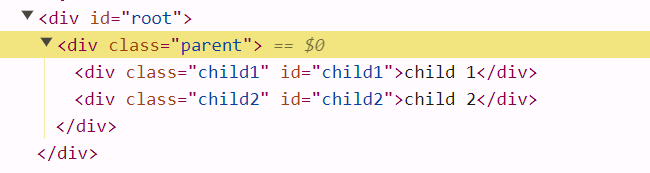

## Q: What is `Emmet`?

A: `Emmet` is the essential toolkit for web-developers. It allows you to `type shortcuts` that are then expanded into full pieces of code for writing `HTML and CSS`, based on an abbreviation structure most developers already use that expands into full-fledged HTML markup and CSS rules.

## Q: Why is `React known as React`?

A: And it's called `React` because it `reacts`. It was developed by Facebook (a site that CONSTANTLY updates their data) to improve the user interface development and more effectively change (REACT to) what the user sees when they're doing things like mouse clicking, submitting and typing.

## Q: What is difference between `React and ReactDOM`?

A: `React` is a JavaScript library for building User Interfaces whereas `ReactDOM` is also JavaScript library that allows `React to interact with the DOM`.

The react package contains `React.createElement()`, `React.Component`, `React.Children`, and other helpers related to elements and component classes. You can think of these as the isomorphic or universal helpers that you need to build components. The react-dom package contains `ReactDOM.render()`

---

-- After practice-2 DOM should look like that

